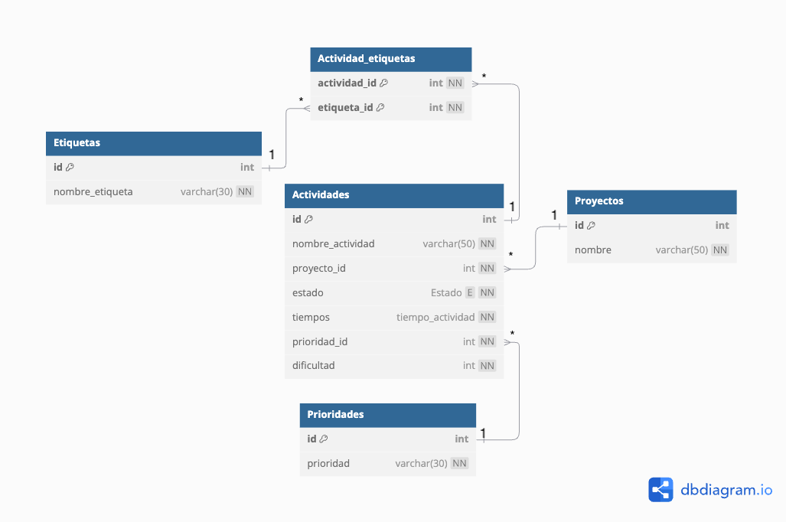

# CRUD Task Manager

Este proyecto es una aplicación de manejo de tareas tipo CRUD, construida con:

* **Backend**: Node.js, Express, TypeORM, PostgreSQL.
* **Frontend**: React, Vite, Tailwind CSS.
* **Contenedores**: Docker & Docker Compose.

---

## 🔧 Configuración inicial

1. Clonar el repositorio:

   ```bash
   git clone <git@github.com:Bamo0507/CRUD_TaskManager.git>
   cd CRUD_TaskManager
   ```

2. Configurar entornos:

   * Copiar y renombrar el fichero de variables de entorno:

     ```bash
     cp env.example .env
     ```

   * Abrir `.env` y ajustar las variables a tu entorno, asegurándote de que los valores de los puertos coincidan con los expuestos en su Dockerfile.

   * Copiar `docker-compose.yml.example` a la raíz como `docker-compose.yml`:

     ```bash
     cp docker-compose.yml.example docker-compose.yml
     ```

   * Revisar `docker-compose.yml` y confirmar que los puertos definidos en las variables de entorno coinciden con los puertos expuestos por los servicios en sus Dockerfiles, buscar el Dockerfile en la carpeta de backend, y ver el puerto que se tenga en EXPOSE, y hacer lo mismo para el Dockefile que está en la carpeta de frontend.

---

## Levantar la aplicación con Docker

En la raíz del proyecto, ejecutar:

```bash
docker-compose up --build
```

Esto hará:

* Construir y arrancar el contenedor `db` con PostgreSQL.
* Construir y arrancar el contenedor `backend`.
* Construir y arrancar el contenedor `frontend`.
* Ejecutar el seed SQL automáticamente tras arrancar el backend.

Una vez levantado:

* **API**: `http://localhost:<BACKEND_PORT>/api`
* **Frontend**: `http://localhost:<FRONTEND_PORT>`

---

## Diagrama entidad relacion

